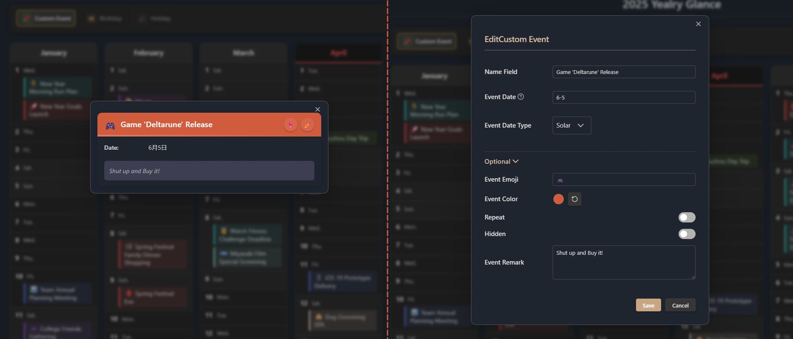
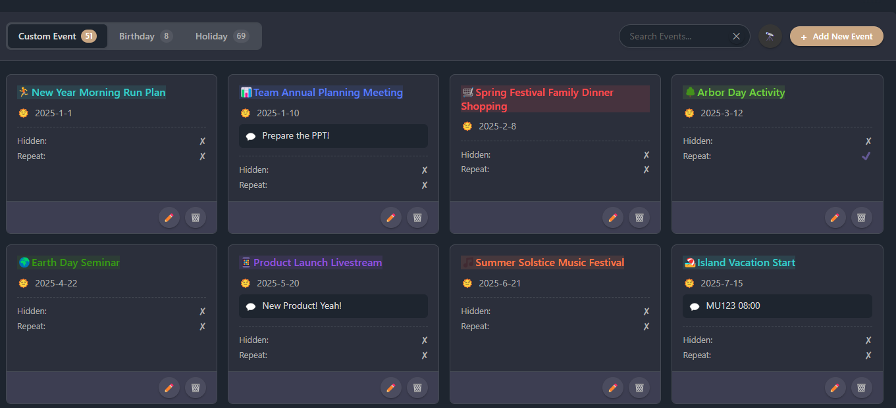
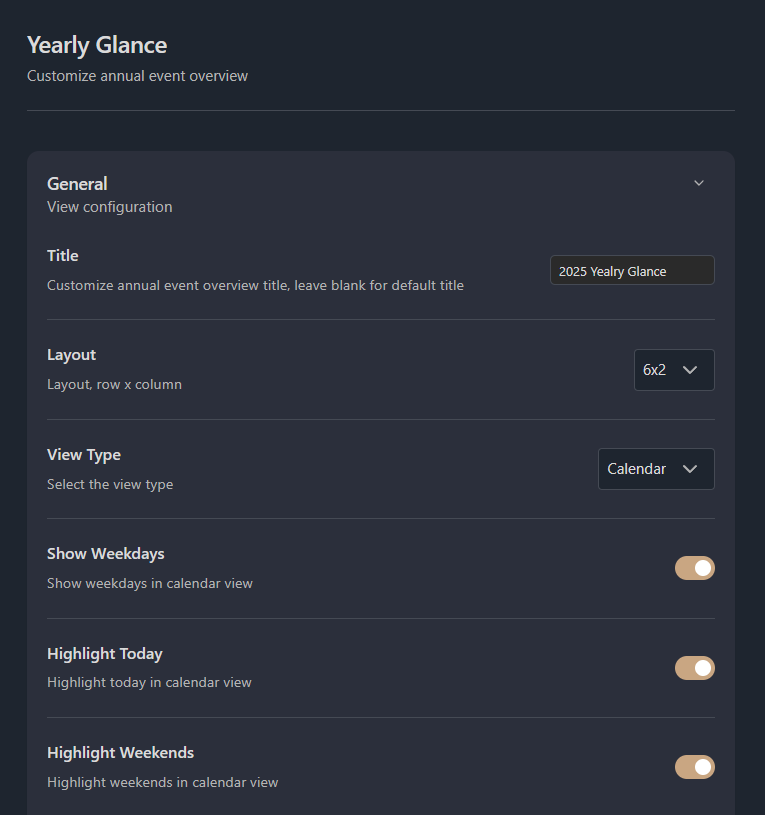

# Yearly Glance - All the moments, at a glance

English | [中文文档](./README-zh.md)

Yearly Glance is an [Obsidian](https://obsidian.md/) plugin, provides Overview of Annual Events with Customizable Management Options.

## Features

Yearly Glance is an Obsidian plugin that provides a visual overview of yearly events, helping you better plan and manage important dates throughout the year. Key features include:

- **Yearly Calendar View**: Visually displays all months of the year in one view
- **Multiple Event Types**: Support for holidays, birthdays, and custom events
- **Highly Customizable**: Multiple layout options and display styles, including custom colors and emojis
- **Interactive Interface**: Click on an event to view detailed information or quick edit
- **Birthday Management**: View important people's birthdays, including age, zodiac, and other attributes
- **Lunar Calendar Support**: Supports traditional Chinese lunar calendar as date format

## Screenshots

Customizable List view:

Also supports classic view:

Filter by event type and hide the empty dates:

View event details, and edit it:

## Usage Guide

### Basic Operations

1. **Opening Yearly Glance**:

   - Click the 🔭 telescope icon in the left sidebar
   - Or, Use the command palette (Ctrl+P) and search for "Open Yearly Glance"
   - Or, Use keyboard shortcuts (if configured)

2. **Viewing Events**:

   - Different colors represent different types of events on the calendar
   - Click on an event to see detailed information
   - Click the 🗂️ Manage button to open events manager and view all events together

3. **Adding Events**:

   1. Select "Open Events Manager" in the command palette, and click the ➕ Add button
   2. Or, hover on a date and click the `+` button that appears
   3. Or, select "Add Event" in the command palette

### Managing Events

1. **Events Manager**:

   - Select "Open Events Manager" in the command palette to open the Events Manager
   - You can also click the 📍 Pin button in Event's detail modal to locate it in the Events Manager

2. **Editing Events**:
   - On the Events Manager, click the ✏️ Edit button on an event to edit it
   - Or, click the ✏️ Edit button in Event's detail modal to edit it
   - Modify the information and save

3. **Deleting Events**:
   - Find the event you want to delete in the event manager
   - Click the 🗑️ Trash button on an event to delete it

### Customization Settings

On top of the overview, there are many display options:

**Display Options**:

- Show/hide holidays, birthdays and custom events
- The layout of view: Yearly Overview (recommended!), Classic Calendar or Customize View!

- Two options for List View only:
  - Limit list height
  - Hide empty dates

You can find more settings in Obsidian settings' plugin settings!

## Installation
### Manual Installation

1. Download the `yearly-glance.zip` from [latest release](https://github.com/Moyf/yearly-glance/releases/latest)
2. Unzip it to your vault's plugins folder: `<vault>/.obsidian/plugins/yearly-glance/`
3. Reload Obsidian
4. Enable the **Yearly Glance** plugin in Settings → Community Plugins

### BRAT (Recommended for Beta Users)

1. Install [BRAT](https://github.com/TfTHacker/obsidian42-brat) plugin
2. Click "Add Beta plugin" in BRAT settings
3. Enter `Moyf/yearly-glance`
4. Enable the plugin

## Development

- Clone this repo
- Make sure your NodeJS is at least v18 (`node --version`)
- `npm i` or `yarn` to install dependencies
- `npm run dev` to start compilation in watch mode
- `npm run build` to build the plugin
- `npm run build:local` to build the plugin and copy it to your vault's plugins folder(need create a .env file in the project root and add the line: VAULT_PATH=/path/to/your/vault)
- `npm run version` to bump the version number and update the manifest.json, version.json, package.json
- `npm run release` to build the plugin and bump the version number

## Support

If you encounter any issues or have suggestions:
- [Open an issue](https://github.com/Moyf/yearly-glance/issues) on GitHub
- [Join the discussion](https://github.com/Moyf/yearly-glance/discussions) for questions and ideas

## License

This project is licensed under the MIT License - see the [LICENSE](LICENSE) file for details.

## Star History

